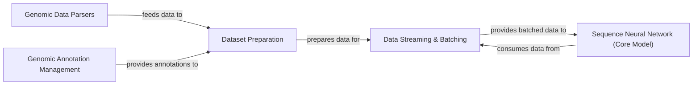

## Component Details

This component manages the entire data pipeline for genomic datasets, encompassing efficient loading, preprocessing, handling of various genomic file formats (e.g., BED, GFF, VCF), and integration of genome-wide annotations. It ensures that data is properly prepared and formatted for subsequent use in model training, evaluation, and prediction within the Basenji project.

### Genomic Data Parsers

These modules are responsible for parsing and handling various genomic file formats such as BED, GFF, VCF, and general DNA sequences. They convert raw genomic data into a structured format for further processing.

**Related Classes/Methods**:

- `basenji.bed` (full file reference)

- `basenji.gff` (full file reference)

- `basenji.vcf` (full file reference)

- `basenji.dna_io` (full file reference)

### Genomic Annotation Management

This component handles the integration and management of genome-wide annotations, including gene-related information. It provides structured access to genomic features and their associated data.

**Related Classes/Methods**:

- `basenji.genome` (full file reference)

- `basenji.gene` (full file reference)

- `basenji.archive.gene` (full file reference)

- `basenji.archive.genedata` (full file reference)

### Dataset Preparation

This component orchestrates the loading, preprocessing, and organization of genomic datasets. It integrates parsed genomic data and annotations to create a unified dataset suitable for model training and evaluation.

**Related Classes/Methods**:

- `basenji.dataset` (full file reference)

### Data Streaming & Batching

This component focuses on efficient data delivery, particularly for machine learning models. It handles the streaming of processed data and the creation of TFRecord batches, optimizing the input pipeline for neural networks.

**Related Classes/Methods**:

- `basenji.stream` (full file reference)

- `basenji.archive.tfrecord_batcher` (full file reference)

### Sequence Neural Network (Core Model)

This is the central neural network component responsible for building, training, evaluating, and making predictions on biological sequences. Its 'predict' method is a key interface for inference.

**Related Classes/Methods**:

- <a href="https://github.com/calico/basenji/blob/master/basenji/seqnn.py#L28-L841" target="_blank" rel="noopener noreferrer">`basenji.seqnn.SeqNN` (28:841)</a>

- <a href="https://github.com/calico/basenji/blob/master/basenji/seqnn.py#L763-L798" target="_blank" rel="noopener noreferrer">`basenji.seqnn.SeqNN:predict` (763:798)</a>

### [FAQ](https://github.com/CodeBoarding/GeneratedOnBoardings/tree/main?tab=readme-ov-file#faq)