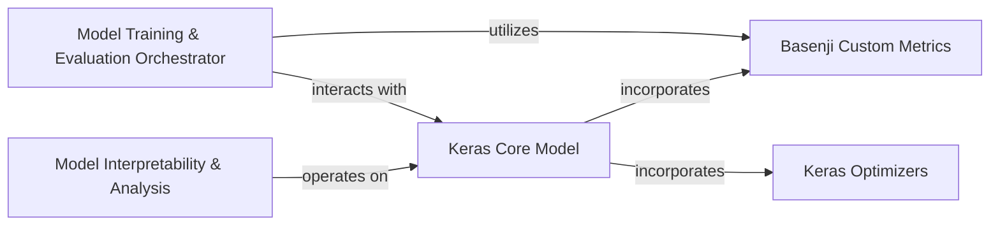

## Component Details

The `Model Orchestration & Analysis` component in Basenji is responsible for managing the entire lifecycle of deep learning models, from training and evaluation to advanced interpretability. It orchestrates the training process by leveraging the `Model Training & Evaluation Orchestrator` to manage training loops and integrate custom evaluation metrics provided by `Basenji Custom Metrics`. Furthermore, it enables in-depth analysis of model predictions and feature importance through the `Model Interpretability & Analysis` sub-component, which utilizes gradient-based methods. This entire process heavily relies on the foundational capabilities of `Keras Core Model` for model definition and execution, and `Keras Optimizers` for weight updates during training.

### Model Training & Evaluation Orchestrator

Manages the training and evaluation lifecycle of Basenji models, coordinating training loops and invoking evaluation procedures.

**Related Classes/Methods**:

- <a href="https://github.com/calico/basenji/blob/master/basenji/trainer.py#L61-L625" target="_blank" rel="noopener noreferrer">`basenji.trainer.Trainer` (61:625)</a>

- <a href="https://github.com/calico/basenji/blob/master/basenji/trainer.py#L33-L59" target="_blank" rel="noopener noreferrer">`basenji.trainer.parse_loss` (33:59)</a>

- <a href="https://github.com/calico/basenji/blob/master/basenji/seqnn.py#L328-L356" target="_blank" rel="noopener noreferrer">`basenji.seqnn.SeqNN:evaluate` (328:356)</a>

### Model Interpretability & Analysis

Provides functionalities for analyzing model predictions and understanding feature importance through gradient-based interpretability methods.

**Related Classes/Methods**:

- <a href="https://github.com/calico/basenji/blob/master/basenji/seqnn.py#L384-L563" target="_blank" rel="noopener noreferrer">`basenji.seqnn.SeqNN:gradients` (384:563)</a>

- <a href="https://github.com/calico/basenji/blob/master/basenji/seqnn.py#L566-L639" target="_blank" rel="noopener noreferrer">`basenji.seqnn.SeqNN:gradients_func` (566:639)</a>

- <a href="https://github.com/calico/basenji/blob/master/basenji/seqnn.py#L641-L715" target="_blank" rel="noopener noreferrer">`basenji.seqnn.SeqNN:gradients_orig` (641:715)</a>

- <a href="https://github.com/calico/basenji/blob/master/basenji/seqnn.py#L718-L740" target="_blank" rel="noopener noreferrer">`basenji.seqnn.SeqNN:gradients_func_orig` (718:740)</a>

### Basenji Custom Metrics

Offers specialized metrics tailored for evaluating Basenji models, including SeqAUC for area under the curve calculations and PearsonR and R2 for regression performance assessment, as well as custom loss functions.

**Related Classes/Methods**:

- <a href="https://github.com/calico/basenji/blob/master/basenji/metrics.py#L109-L241" target="_blank" rel="noopener noreferrer">`basenji.metrics.SeqAUC` (109:241)</a>

- <a href="https://github.com/calico/basenji/blob/master/basenji/metrics.py#L244-L312" target="_blank" rel="noopener noreferrer">`basenji.metrics.PearsonR` (244:312)</a>

- <a href="https://github.com/calico/basenji/blob/master/basenji/metrics.py#L315-L372" target="_blank" rel="noopener noreferrer">`basenji.metrics.R2` (315:372)</a>

- <a href="https://github.com/calico/basenji/blob/master/basenji/metrics.py#L31-L36" target="_blank" rel="noopener noreferrer">`basenji.metrics.MeanSquaredErrorUDot` (31:36)</a>

- <a href="https://github.com/calico/basenji/blob/master/basenji/metrics.py#L57-L62" target="_blank" rel="noopener noreferrer">`basenji.metrics.PoissonKL` (57:62)</a>

- <a href="https://github.com/calico/basenji/blob/master/basenji/metrics.py#L98-L103" target="_blank" rel="noopener noreferrer">`basenji.metrics.PoissonMultinomial` (98:103)</a>

### Keras Core Model

Represents the fundamental Keras model functionalities, including methods for compiling the model with an optimizer, loss function, and metrics, and for executing the evaluation process on a dataset.

**Related Classes/Methods**:

- `tf.keras.Model:compile` (full file reference)

- `tf.keras.Model:evaluate` (full file reference)

### Keras Optimizers

Provides various optimization algorithms, such as Stochastic Gradient Descent (SGD), which are used by Keras models during the compilation phase to update model weights and minimize loss.

**Related Classes/Methods**:

- `tf.keras.optimizers.SGD` (full file reference)

### [FAQ](https://github.com/CodeBoarding/GeneratedOnBoardings/tree/main?tab=readme-ov-file#faq)