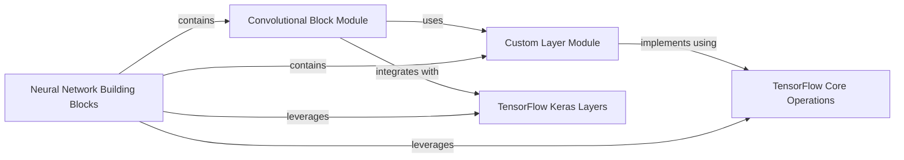

## Component Details

This component offers a collection of reusable neural network layers and architectural patterns, including convolutional and recurrent blocks. These blocks are essential for the `SeqNN Model Core` to construct complex deep learning models tailored for genomic sequence analysis.

### Neural Network Building Blocks

This component offers a collection of reusable neural network layers and architectural patterns, including convolutional and recurrent blocks. These blocks are essential for the `SeqNN Model Core` to construct complex deep learning models tailored for genomic sequence analysis.

**Related Classes/Methods**:

- <a href="https://github.com/calico/basenji/blob/master/basenji/blocks.py#L1-L300" target="_blank" rel="noopener noreferrer">`basenji.blocks` (1:300)</a>

- <a href="https://github.com/calico/basenji/blob/master/basenji/layers.py#L1-L300" target="_blank" rel="noopener noreferrer">`basenji.layers` (1:300)</a>

### Convolutional Block Module

This module provides reusable convolutional building blocks for neural network architectures. It includes general-purpose convolutional blocks (conv_block) and specialized blocks for DNA sequences (conv_dna), handling various convolution types, normalization, activation, and pooling. It also integrates with other custom basenji components like squeeze_excite and conv_nac.

**Related Classes/Methods**:

- <a href="https://github.com/calico/basenji/blob/master/basenji/blocks.py#L23-L108" target="_blank" rel="noopener noreferrer">`basenji.blocks.conv_block` (23:108)</a>

- <a href="https://github.com/calico/basenji/blob/master/basenji/blocks.py#L111-L208" target="_blank" rel="noopener noreferrer">`basenji.blocks.conv_dna` (111:208)</a>

- <a href="https://github.com/calico/basenji/blob/master/basenji/blocks.py#L1287-L1290" target="_blank" rel="noopener noreferrer">`basenji.blocks.squeeze_excite` (1287:1290)</a>

- <a href="https://github.com/calico/basenji/blob/master/basenji/blocks.py#L211-L294" target="_blank" rel="noopener noreferrer">`basenji.blocks.conv_nac` (211:294)</a>

### Custom Layer Module

This module defines custom Keras layers that extend TensorFlow's capabilities for specific operations within the basenji project. These layers include activation functions, pooling mechanisms, and utility operations like clipping and scaling.

**Related Classes/Methods**:

- <a href="https://github.com/calico/basenji/blob/master/basenji/layers.py#L1353-L1375" target="_blank" rel="noopener noreferrer">`basenji.layers.activate` (1353:1375)</a>

- <a href="https://github.com/calico/basenji/blob/master/basenji/layers.py#L826-L870" target="_blank" rel="noopener noreferrer">`basenji.layers.SoftmaxPool1D` (826:870)</a>

- <a href="https://github.com/calico/basenji/blob/master/basenji/layers.py#L30-L31" target="_blank" rel="noopener noreferrer">`basenji.layers.Clip.call` (30:31)</a>

- <a href="https://github.com/calico/basenji/blob/master/basenji/layers.py#L52-L61" target="_blank" rel="noopener noreferrer">`basenji.layers.Exp.call` (52:61)</a>

- <a href="https://github.com/calico/basenji/blob/master/basenji/layers.py#L111-L113" target="_blank" rel="noopener noreferrer">`basenji.layers.Scale.call` (111:113)</a>

- <a href="https://github.com/calico/basenji/blob/master/basenji/layers.py#L127-L130" target="_blank" rel="noopener noreferrer">`basenji.layers.PolyReLU.call` (127:130)</a>

- <a href="https://github.com/calico/basenji/blob/master/basenji/layers.py#L136-L138" target="_blank" rel="noopener noreferrer">`basenji.layers.Softplus.call` (136:138)</a>

- <a href="https://github.com/calico/basenji/blob/master/basenji/layers.py#L153-L157" target="_blank" rel="noopener noreferrer">`basenji.layers.CenterSlice.call` (153:157)</a>

- <a href="https://github.com/calico/basenji/blob/master/basenji/layers.py#L170-L171" target="_blank" rel="noopener noreferrer">`basenji.layers.CenterAverage.call` (170:171)</a>

- <a href="https://github.com/calico/basenji/blob/master/basenji/layers.py#L184-L201" target="_blank" rel="noopener noreferrer">`basenji.layers.LengthAverage.call` (184:201)</a>

### TensorFlow Keras Layers

This component represents the standard, pre-built layers provided by TensorFlow's Keras API. These layers are fundamental for constructing neural networks and are extensively used by the basenji convolutional blocks for operations like convolution, normalization, dropout, and pooling.

**Related Classes/Methods**:

- `tf.keras.layers.SeparableConv1D` (full file reference)

- `tf.keras.layers.Conv1D` (full file reference)

- `tf.keras.regularizers.l2` (full file reference)

- `tf.keras.layers.experimental.SyncBatchNormalization` (full file reference)

- `tf.keras.layers.BatchNormalization` (full file reference)

- `tf.keras.layers.LayerNormalization` (full file reference)

- `tf.keras.layers.Dropout` (full file reference)

- `tf.keras.layers.Add` (full file reference)

- `tf.keras.layers.MaxPool1D` (full file reference)

### TensorFlow Core Operations

This component encompasses the low-level mathematical and tensor manipulation functions directly from the TensorFlow library. These operations are utilized by the custom basenji layers to perform fundamental computations such as value clipping, power calculations, and reductions.

**Related Classes/Methods**:

- `tf.clip_by_value` (full file reference)

- `tf.keras.activations.exponential` (full file reference)

- `tf.math.pow` (full file reference)

- `tf.keras.activations.relu` (full file reference)

- `tf.keras.activations.softplus` (full file reference)

- `tf.keras.backend.mean` (full file reference)

- `tf.math.reduce_sum` (full file reference)

- `tf.expand_dims` (full file reference)

- `tf.math.reduce_mean` (full file reference)

### [FAQ](https://github.com/CodeBoarding/GeneratedOnBoardings/tree/main?tab=readme-ov-file#faq)