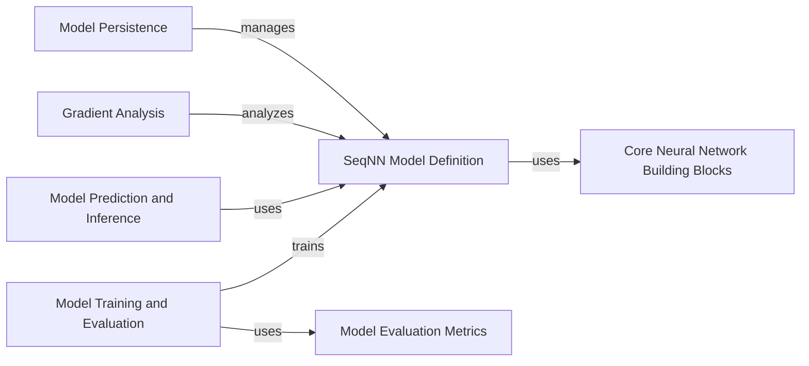

## Component Details

This document outlines the architecture of the `SeqNN Model Core` subsystem, which is responsible for the construction, training, prediction, and analysis of the `SeqNN` deep learning model. It details the interactions between components like model definition, training, inference, gradient analysis, persistence, and the underlying neural network building blocks and evaluation metrics.

### SeqNN Model Definition

This component is responsible for defining and constructing the `SeqNN` neural network architecture. It includes methods for initializing the model, building convolutional blocks and heads, and configuring advanced features like embedding layers, ensemble models, and output transformations. It acts as the blueprint for the Basenji deep learning model.

**Related Classes/Methods**:

- <a href="https://github.com/calico/basenji/blob/master/basenji/seqnn.py#L28-L841" target="_blank" rel="noopener noreferrer">`basenji.seqnn.SeqNN` (28:841)</a>

- <a href="https://github.com/calico/basenji/blob/master/basenji/seqnn.py#L30-L35" target="_blank" rel="noopener noreferrer">`basenji.seqnn.SeqNN.__init__` (30:35)</a>

- <a href="https://github.com/calico/basenji/blob/master/basenji/seqnn.py#L37-L43" target="_blank" rel="noopener noreferrer">`basenji.seqnn.SeqNN.set_defaults` (37:43)</a>

- <a href="https://github.com/calico/basenji/blob/master/basenji/seqnn.py#L106-L208" target="_blank" rel="noopener noreferrer">`basenji.seqnn.SeqNN.build_model` (106:208)</a>

- <a href="https://github.com/calico/basenji/blob/master/basenji/seqnn.py#L45-L104" target="_blank" rel="noopener noreferrer">`basenji.seqnn.SeqNN.build_block` (45:104)</a>

- <a href="https://github.com/calico/basenji/blob/master/basenji/seqnn.py#L211-L222" target="_blank" rel="noopener noreferrer">`basenji.seqnn.SeqNN.build_embed` (211:222)</a>

- <a href="https://github.com/calico/basenji/blob/master/basenji/seqnn.py#L225-L258" target="_blank" rel="noopener noreferrer">`basenji.seqnn.SeqNN.build_ensemble` (225:258)</a>

- <a href="https://github.com/calico/basenji/blob/master/basenji/seqnn.py#L261-L273" target="_blank" rel="noopener noreferrer">`basenji.seqnn.SeqNN.build_sad` (261:273)</a>

- <a href="https://github.com/calico/basenji/blob/master/basenji/seqnn.py#L276-L298" target="_blank" rel="noopener noreferrer">`basenji.seqnn.SeqNN.build_slice` (276:298)</a>

- <a href="https://github.com/calico/basenji/blob/master/basenji/seqnn.py#L301-L325" target="_blank" rel="noopener noreferrer">`basenji.seqnn.SeqNN.downcast` (301:325)</a>

- <a href="https://github.com/calico/basenji/blob/master/basenji/seqnn.py#L359-L362" target="_blank" rel="noopener noreferrer">`basenji.seqnn.SeqNN.get_bn_layer` (359:362)</a>

- <a href="https://github.com/calico/basenji/blob/master/basenji/seqnn.py#L365-L368" target="_blank" rel="noopener noreferrer">`basenji.seqnn.SeqNN.get_conv_layer` (365:368)</a>

- <a href="https://github.com/calico/basenji/blob/master/basenji/seqnn.py#L371-L374" target="_blank" rel="noopener noreferrer">`basenji.seqnn.SeqNN.get_dense_layer` (371:374)</a>

- <a href="https://github.com/calico/basenji/blob/master/basenji/seqnn.py#L377-L382" target="_blank" rel="noopener noreferrer">`basenji.seqnn.SeqNN.get_conv_weights` (377:382)</a>

- <a href="https://github.com/calico/basenji/blob/master/basenji/seqnn.py#L743-L747" target="_blank" rel="noopener noreferrer">`basenji.seqnn.SeqNN.num_targets` (743:747)</a>

### Model Training and Evaluation

This component manages the training lifecycle of the `SeqNN` model, including compilation, optimization, and performance evaluation. It integrates with datasets and metrics to orchestrate the learning process and assess model accuracy.

**Related Classes/Methods**:

- <a href="https://github.com/calico/basenji/blob/master/basenji/trainer.py#L61-L625" target="_blank" rel="noopener noreferrer">`basenji.trainer.Trainer` (61:625)</a>

- <a href="https://github.com/calico/basenji/blob/master/basenji/seqnn.py#L328-L356" target="_blank" rel="noopener noreferrer">`basenji.seqnn.SeqNN.evaluate` (328:356)</a>

### Model Prediction and Inference

This component provides the interface for applying the trained `SeqNN` model to new data, enabling direct predictions, handling various data input streams, and managing sequence position stepping for comprehensive inference.

**Related Classes/Methods**:

- <a href="https://github.com/calico/basenji/blob/master/basenji/seqnn.py#L750-L760" target="_blank" rel="noopener noreferrer">`basenji.seqnn.SeqNN.__call__` (750:760)</a>

- <a href="https://github.com/calico/basenji/blob/master/basenji/seqnn.py#L763-L798" target="_blank" rel="noopener noreferrer">`basenji.seqnn.SeqNN.predict` (763:798)</a>

- <a href="https://github.com/calico/basenji/blob/master/basenji/seqnn.py#L816-L841" target="_blank" rel="noopener noreferrer">`basenji.seqnn.SeqNN.step` (816:841)</a>

### Gradient Analysis

This component is dedicated to computing and processing gradients of the `SeqNN` model's output with respect to its input. It offers various methods for gradient calculation and transformation, crucial for model interpretability and understanding feature importance.

**Related Classes/Methods**:

- <a href="https://github.com/calico/basenji/blob/master/basenji/seqnn.py#L384-L563" target="_blank" rel="noopener noreferrer">`basenji.seqnn.SeqNN.gradients` (384:563)</a>

- <a href="https://github.com/calico/basenji/blob/master/basenji/seqnn.py#L566-L639" target="_blank" rel="noopener noreferrer">`basenji.seqnn.SeqNN.gradients_func` (566:639)</a>

- <a href="https://github.com/calico/basenji/blob/master/basenji/seqnn.py#L641-L715" target="_blank" rel="noopener noreferrer">`basenji.seqnn.SeqNN.gradients_orig` (641:715)</a>

- <a href="https://github.com/calico/basenji/blob/master/basenji/seqnn.py#L718-L740" target="_blank" rel="noopener noreferrer">`basenji.seqnn.SeqNN.gradients_func_orig` (718:740)</a>

### Model Persistence

This component handles the serialization and deserialization of the `SeqNN` model, allowing for saving its weights and architecture to disk and loading them back. This ensures the reusability and long-term availability of trained models.

**Related Classes/Methods**:

- <a href="https://github.com/calico/basenji/blob/master/basenji/seqnn.py#L801-L807" target="_blank" rel="noopener noreferrer">`basenji.seqnn.SeqNN.restore` (801:807)</a>

- <a href="https://github.com/calico/basenji/blob/master/basenji/seqnn.py#L810-L814" target="_blank" rel="noopener noreferrer">`basenji.seqnn.SeqNN.save` (810:814)</a>

### Core Neural Network Building Blocks

This component comprises the fundamental custom layers and architectural blocks that are used by the `SeqNN Model Definition` component to construct the deep learning model's complex structure.

**Related Classes/Methods**:

- `basenji.blocks` (full file reference)

- `basenji.layers` (full file reference)

### Model Evaluation Metrics

This component provides specialized metrics, such as PearsonR, R2, and SeqAUC, essential for quantitatively assessing the performance and accuracy of the `SeqNN` model during its training and evaluation phases.

**Related Classes/Methods**:

- `basenji.metrics` (full file reference)

### [FAQ](https://github.com/CodeBoarding/GeneratedOnBoardings/tree/main?tab=readme-ov-file#faq)