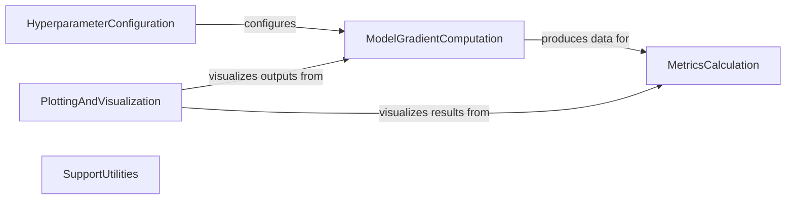

## Component Details

This architecture outlines the core components of a genomic deep learning project, focusing on model configuration, gradient computation, performance metric calculation, and data visualization. The `HyperparameterConfiguration` component initializes the model's parameters, which are then utilized by `ModelGradientComputation` to process genomic data and compute gradients. The outputs from `ModelGradientComputation` are subsequently evaluated by `MetricsCalculation` to assess model performance. Finally, `PlottingAndVisualization` leverages data from both `ModelGradientComputation` and `MetricsCalculation` to generate insightful visualizations, while `SupportUtilities` provides general-purpose helper functions across the project.

### MetricsCalculation

This component is responsible for calculating various statistical metrics, including R2 and variance, which are crucial for evaluating model performance. It provides functions for both overall and per-target calculations of mean and variance.

**Related Classes/Methods**:

- <a href="https://github.com/calico/basenji/blob/master/basenji/archive/ops.py#L127-L145" target="_blank" rel="noopener noreferrer">`basenji.archive.ops.r2_metric` (127:145)</a>

- <a href="https://github.com/calico/basenji/blob/master/basenji/archive/ops.py#L100-L124" target="_blank" rel="noopener noreferrer">`basenji.archive.ops.variance` (100:124)</a>

- <a href="https://github.com/calico/basenji/blob/master/basenji/archive/ops.py#L178-L202" target="_blank" rel="noopener noreferrer">`basenji.archive.ops._per_target_variance` (178:202)</a>

- <a href="https://github.com/calico/basenji/blob/master/basenji/archive/ops.py#L148-L175" target="_blank" rel="noopener noreferrer">`basenji.archive.ops._per_target_mean` (148:175)</a>

### HyperparameterConfiguration

This component handles the creation and management of hyperparameters for the Basenji model. It parses job arguments and sets up various parameters related to data, batching, training optimization, loss functions, and neural network architecture.

**Related Classes/Methods**:

- <a href="https://github.com/calico/basenji/blob/master/basenji/archive/params.py#L89-L221" target="_blank" rel="noopener noreferrer">`basenji.archive.params.make_hparams` (89:221)</a>

### ModelGradientComputation

This component is central to the neural network's training and analysis, focusing on computing gradients and representations across different layers of the SeqNNModel. It supports ensemble predictions and handles various input augmentations.

**Related Classes/Methods**:

- <a href="https://github.com/calico/basenji/blob/master/basenji/archive/seqnn_util.py#L10-L50" target="_blank" rel="noopener noreferrer">`basenji.archive.seqnn_util.SeqNNModel.gradients` (10:50)</a>

- <a href="https://github.com/calico/basenji/blob/master/basenji/archive/seqnn_util.py#L53-L90" target="_blank" rel="noopener noreferrer">`basenji.archive.seqnn_util.SeqNNModel._gradients_ensemble` (53:90)</a>

### PlottingAndVisualization

This component provides utilities for generating various types of plots, such as joint plots and regression plots, to visualize data and model outputs. It includes functions for setting appropriate plot limits.

**Related Classes/Methods**:

- <a href="https://github.com/calico/basenji/blob/master/basenji/plots.py#L31-L142" target="_blank" rel="noopener noreferrer">`basenji.plots.jointplot` (31:142)</a>

- <a href="https://github.com/calico/basenji/blob/master/basenji/plots.py#L145-L246" target="_blank" rel="noopener noreferrer">`basenji.plots.regplot` (145:246)</a>

- <a href="https://github.com/calico/basenji/blob/master/basenji/plots.py#L249-L265" target="_blank" rel="noopener noreferrer">`basenji.plots.scatter_lims` (249:265)</a>

### SupportUtilities

This component provides a range of general-purpose helper functions and utilities that support various operations across the project, such as parallel command execution.

**Related Classes/Methods**:

- <a href="https://github.com/calico/basenji/blob/master/basenji/util.py#L11-L54" target="_blank" rel="noopener noreferrer">`basenji.util.exec_par` (11:54)</a>

### [FAQ](https://github.com/CodeBoarding/GeneratedOnBoardings/tree/main?tab=readme-ov-file#faq)