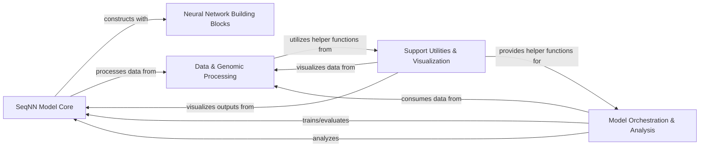

## Component Details

The `basenji` project is designed for deep learning analysis of genomic sequences, primarily focusing on building and applying the SeqNN neural network model. The main flow involves preparing genomic data, constructing and training the SeqNN model, evaluating its performance, and interpreting its predictions to understand genomic feature importance. The project provides a comprehensive set of tools for data handling, model development, and result visualization.

### SeqNN Model Core

This component embodies the fundamental neural network architecture, `SeqNN`, responsible for constructing, managing, and executing the deep learning model. It performs core operations such as prediction and integrates various custom layers and building blocks to define the computational graph for sequence analysis.

**Related Classes/Methods**:

- <a href="https://github.com/calico/basenji/blob/master/basenji/seqnn.py#L28-L841" target="_blank" rel="noopener noreferrer">`basenji.seqnn.SeqNN` (28:841)</a>

### Neural Network Building Blocks

This component offers a collection of reusable neural network layers and architectural patterns, including convolutional and recurrent blocks. These blocks are essential for the `SeqNN Model Core` to construct complex deep learning models tailored for genomic sequence analysis.

**Related Classes/Methods**:

- `basenji.blocks` (full file reference)

- `basenji.layers` (full file reference)

### Data & Genomic Processing

This component manages the entire data pipeline, from efficient loading and preprocessing of genomic datasets to handling various genomic file formats (e.g., BED, GFF, VCF) and integrating genome-wide annotations. It ensures data is prepared and provided in the correct format for model training, evaluation, and prediction.

**Related Classes/Methods**:

- `basenji.dataset` (full file reference)

- `basenji.stream` (full file reference)

- `basenji.archive.tfrecord_batcher` (full file reference)

- `basenji.dna_io` (full file reference)

- `basenji.bed` (full file reference)

- `basenji.gff` (full file reference)

- `basenji.vcf` (full file reference)

- `basenji.genome` (full file reference)

- `basenji.gene` (full file reference)

- `basenji.archive.gene` (full file reference)

- `basenji.archive.genedata` (full file reference)

- <a href="https://github.com/calico/basenji/blob/master/basenji/seqnn.py#L763-L798" target="_blank" rel="noopener noreferrer">`basenji.seqnn.SeqNN:predict` (763:798)</a>

### Model Orchestration & Analysis

This component oversees the complete lifecycle of model training, evaluation, and interpretability. It coordinates the training loops, applies custom metrics for performance assessment, and provides functionalities for analyzing model predictions, including gradient-based interpretability methods to understand feature importance.

**Related Classes/Methods**:

- `basenji.trainer` (full file reference)

- `basenji.metrics` (full file reference)

- <a href="https://github.com/calico/basenji/blob/master/basenji/seqnn.py#L328-L356" target="_blank" rel="noopener noreferrer">`basenji.seqnn.SeqNN:evaluate` (328:356)</a>

- <a href="https://github.com/calico/basenji/blob/master/basenji/seqnn.py#L384-L563" target="_blank" rel="noopener noreferrer">`basenji.seqnn.SeqNN:gradients` (384:563)</a>

- <a href="https://github.com/calico/basenji/blob/master/basenji/seqnn.py#L566-L639" target="_blank" rel="noopener noreferrer">`basenji.seqnn.SeqNN:gradients_func` (566:639)</a>

- <a href="https://github.com/calico/basenji/blob/master/basenji/seqnn.py#L641-L715" target="_blank" rel="noopener noreferrer">`basenji.seqnn.SeqNN:gradients_orig` (641:715)</a>

- <a href="https://github.com/calico/basenji/blob/master/basenji/seqnn.py#L718-L740" target="_blank" rel="noopener noreferrer">`basenji.seqnn.SeqNN:gradients_func_orig` (718:740)</a>

### Support Utilities & Visualization

This component provides a range of general-purpose helper functions and utilities that support various operations across the project. Additionally, it includes tools for generating plots and visualizations, enabling users to inspect model outputs, analyze genomic data patterns, and interpret results effectively.

**Related Classes/Methods**:

- `basenji.util` (full file reference)

- `basenji.archive.ops` (full file reference)

- `basenji.archive.params` (full file reference)

- `basenji.archive.seqnn_util` (full file reference)

- `basenji.plots` (full file reference)

### [FAQ](https://github.com/CodeBoarding/GeneratedOnBoardings/tree/main?tab=readme-ov-file#faq)